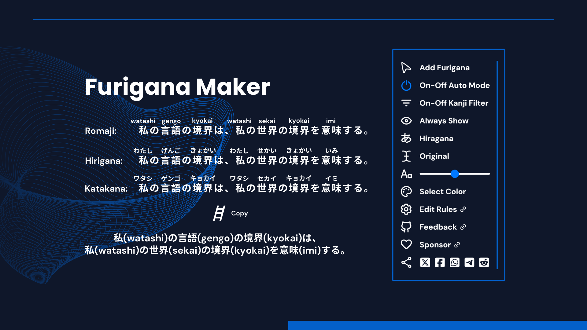

    
    <h1>Furigana Maker</h1>
    

      
      
      
    

## Introduction

Add furigana to Japanese text on any page for learning kanji pronunciation. 🤔

Special thanks to **_[WXT](https://wxt.dev/)_** for taking the frustration out of browser extension development for me, it's amazing!

## Download

- [Chrome Web Store](https://chromewebstore.google.com/detail/furigana-maker/heodojceeinbkfjfilnfminlkgbacpfp)

> [!IMPORTANT]
> The Edge version of this extension will no longer be maintained due to [Microsoft Partner issue](https://github.com/aiktb/furiganamaker/issues/21), please use the latest version from the Chrome Web Store.

## Features

- **Automatic Furigana on Popular Sites:** Works on sites like Twitter, Asahi, Wikipedia, and more.
- **Customizable Rules:** Use CSS selectors and domain settings to control where furigana appears.
- **Manual Selection:** Highlight any text on a page to add furigana instantly.
- **JLPT Kanji Filtering:** Pre-set N5/N4 kanji filters, fully customizable for learners.
- **Appearance Control:** Adjust furigana font size, color, and visibility; optional hover mode.
- **Interactive Playground:** Type or paste Japanese text to see furigana generated in real time. Experiment with settings and preview results instantly.
## Preview

## Contribution

Please make sure to read the [Contributing Guide](./.github/CONTRIBUTING.md) before making a pull request.

This includes instructions on how to setup development environment, test extensions, and build the final product.

## Changelog

Detailed changes for each release are documented in the [CHANGELOG](./apps/extension/CHANGELOG.md).

## Sponsor

If you like this project, please consider supporting me by buying me a coffee.

## License

[MIT](./LICENSE) | © 2023 aiktb made with ❤️.
